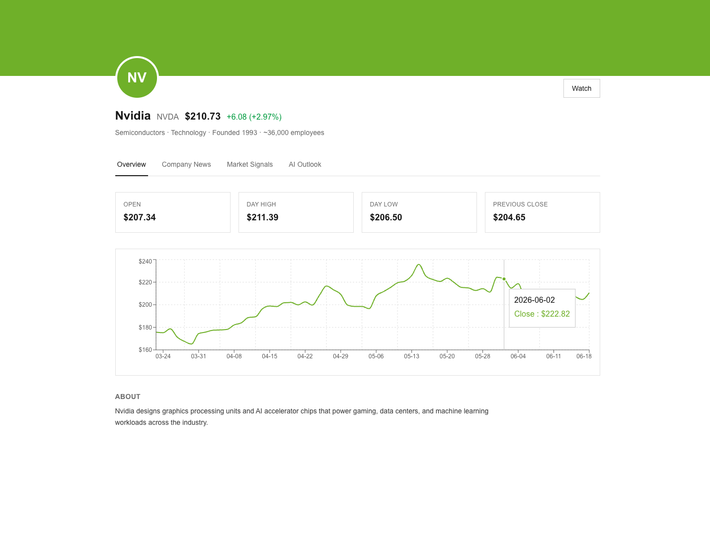

# livestock


LiveStock explores whether price history, technical indicators, and news sentiment carry signal about stock direction over short time horizons. Each company gets its own page with live data, curated news, an XGBoost model outputting probability estimates, and Claude synthesizing the top SHAP features into plain English. Not a trading product.

See the [LiveStock Design Doc](https://docs.google.com/document/d/1tKu3NXJGf_oY61p60CvZvaHivoP0Zm7w) for the full product design rationale.

#### 🏗️ Under Construction 🏗️



## Project structure

```
livestock/
├── frontend/   Next.js 16 (App Router), TypeScript, Tailwind — UI + API routes
├── ml/         Python 3.12 — data pipeline, feature engineering, XGBoost + SHAP model
├── docs/       Design notes, screenshots, and a running journal of findings
└── README.md
```

## Status

| Area | Status |
| --- | --- |
| Homepage (company card grid) | Live data |
| Company page — Overview tab | Live data (quote, 90-day chart, key stats) |
| Company page — Company News tab | Live data |
| Company page — Market Signals tab | Placeholder |
| Company page — AI Outlook tab | Placeholder |
| `ml/` data pipeline (historical OHLCV, technical indicators, targets) | Built, tested |
| `ml/` sentiment scoring (FinBERT) | Built, tested |
| `ml/` baseline XGBoost + SHAP model | Built, tested — see [`docs/JOURNAL.mdx`](docs/JOURNAL.mdx) for current accuracy and findings |
| `ml/` FastAPI service (`/predict/{ticker}`) | Built, tested |
| Frontend ↔ ML backend connection | Not started |

For a detailed, ongoing log of what's been tried, what worked, and what didn't (data source limitations, modeling pitfalls, etc.), see [`docs/JOURNAL.mdx`](docs/JOURNAL.mdx).

## Tech stack

- **Frontend**: Next.js 16 (App Router), TypeScript, Tailwind CSS, Recharts, TanStack Query
- **Live data**: Finnhub (quotes, news), `yahoo-finance2` (historical OHLCV — Finnhub's free tier doesn't include this)
- **ML**: pandas, XGBoost, SHAP, FinBERT (`transformers`/`torch`) for news sentiment
- **AI synthesis**: Anthropic API (Claude), not yet wired up

## Frontend setup

1. Install dependencies:
   ```bash
   cd frontend
   npm install
   ```
2. Copy the env template and fill in your keys:
   ```bash
   cp .env.example .env.local
   ```
   - `FINNHUB_API_KEY` — required for live stock quotes and news
   - `ANTHROPIC_API_KEY` — required for the AI outlook synthesis (placeholder for now)
   - `ML_BACKEND_URL` — defaults to `http://localhost:8000`, not used until the FastAPI service exists
3. Run the dev server:
   ```bash
   npm run dev
   ```
4. Open [http://localhost:3000](http://localhost:3000).

Without a `FINNHUB_API_KEY`, the homepage and company pages still render, but live price data will show as unavailable. The 90-day price chart uses `yahoo-finance2` and works without any API key.

## ML backend setup

Requires Python 3.12 (the macOS system Python is too old). On macOS, XGBoost also needs `libomp`, which isn't bundled.

```bash
brew install python@3.12 libomp   # macOS only
cd ml
/opt/homebrew/bin/python3.12 -m venv venv
source venv/bin/activate
pip install -r requirements.txt
cp .env.example .env              # add FINNHUB_API_KEY
```

Each module can be run directly to inspect its output:

```bash
python -m data.fetch_historical       # pull historical OHLCV for NVDA
python -m features.technical_indicators
python -m features.sentiment          # scores sample headlines with FinBERT
python -m models.baseline_xgboost     # trains the pooled baseline model, prints accuracy + SHAP
```

Re-activate the venv (`source venv/bin/activate`) in every new shell — it doesn't persist across sessions.

To run the prediction API:

```bash
uvicorn api.main:app --port 8000
```

Training happens once at startup (a few seconds), then `GET /predict/{ticker}` serves predictions from the in-memory model. Supported tickers: `TSLA`, `NVDA`, `MSFT`, `META`, `AMZN`, `GOOGL`. Every response includes the model's own accuracy and the majority-class baseline alongside the prediction — the model doesn't reliably beat that baseline yet (see [`docs/JOURNAL.mdx`](docs/JOURNAL.mdx)), and that should stay visible, not be hidden behind a confident-looking number. Interactive docs at `http://localhost:8000/docs`.
